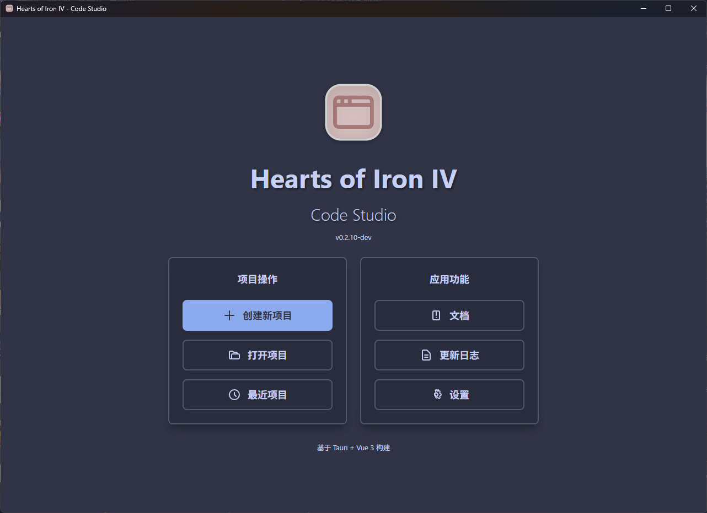
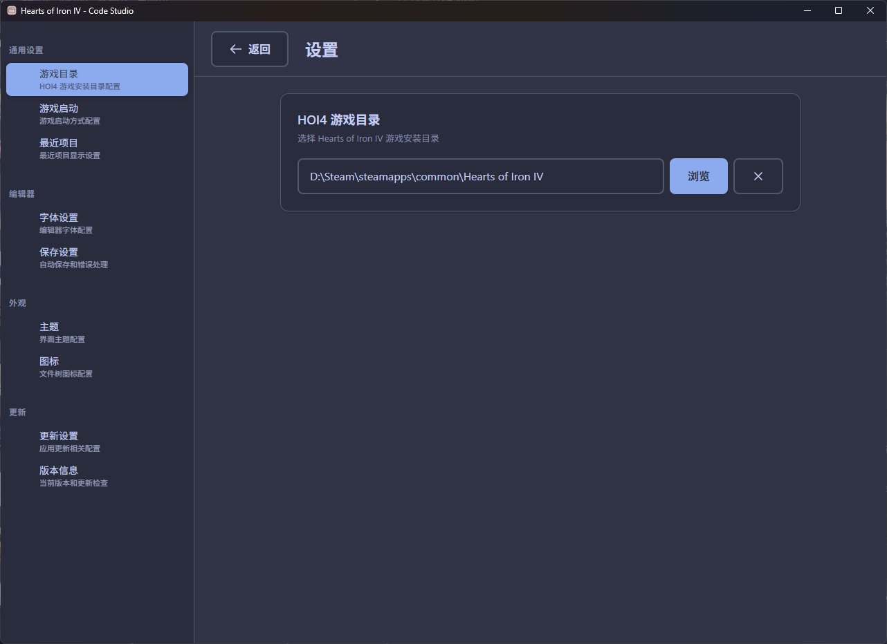
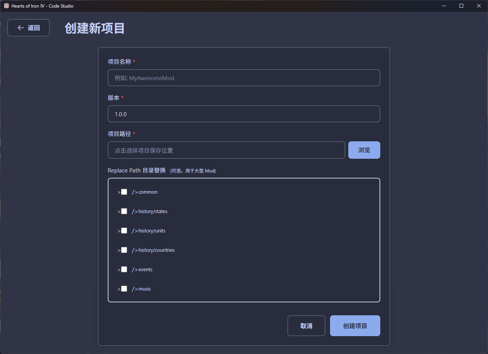
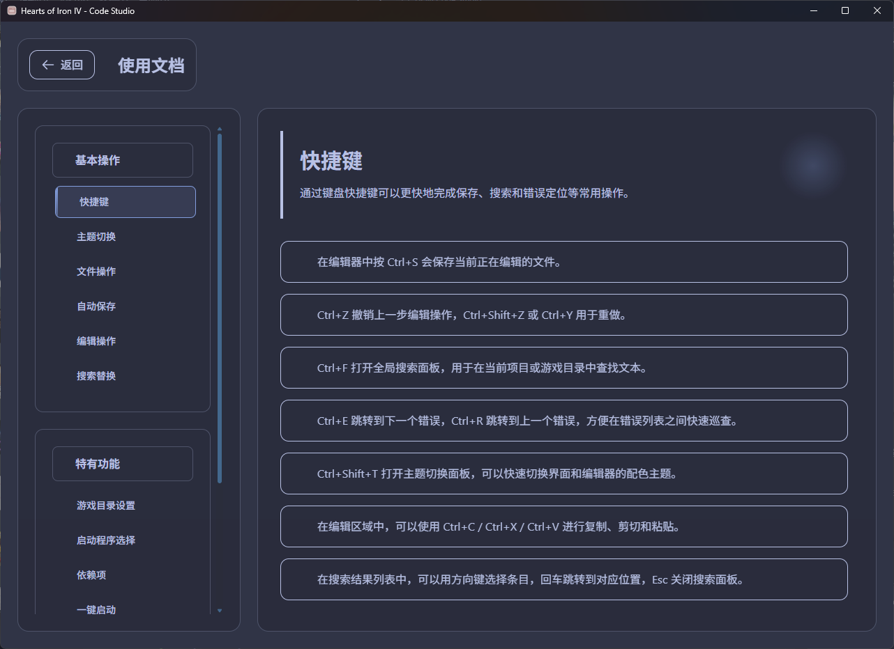
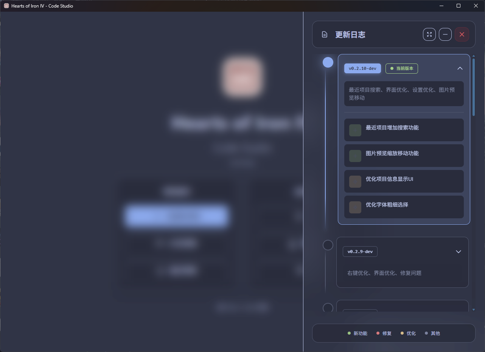
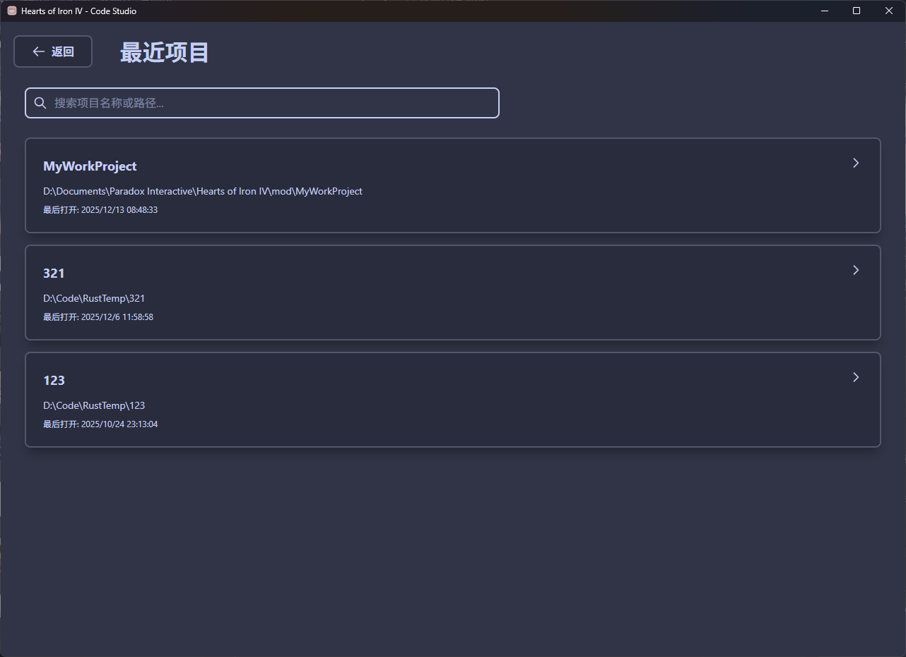
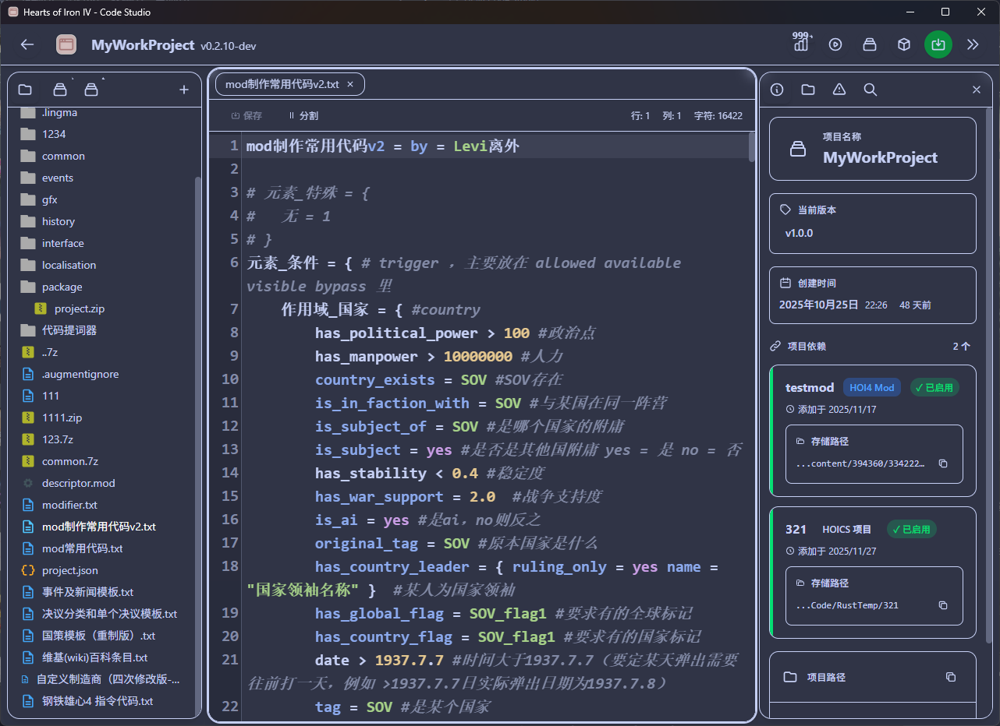

# Hearts of Iron IV - Code Studio

<div align="center">
  
  <h3>Hearts of Iron IV - Code Studio</h3>
  <p>专为《钢铁雄心IV》Mod开发者设计的桌面集成开发环境</p>
  <p>
    
    
    
    
  </p>
</div>

一个基于 **Tauri + Vue 3 + Rust** 的专业级Hearts of Iron IV Mod编辑器桌面应用程序，提供类似VSCode的编辑体验，集成HOI4专用开发工具。

## 主页


## 🚀 快速开始

### 前置要求

- Node.js 18+
- Rust 1.90
- npm

### 安装依赖

```bash
npm install
```
### 开发后测试

```bash
npm run test:ui
cd src-tauri
cargo test
```

### 开发模式（运行桌面应用）

```bash
npm run tauri dev
```
### 构建桌面应用

```bash
npm run tauri build
```

构建完成后，可执行文件位于：
- `src-tauri/target/release/HOI4 Code Studio.exe`


## 🛠️ 技术栈

### 前端技术
- **Vue 3.5.13** - 渐进式JavaScript框架，使用Composition API
- **TypeScript 5.0+** - 提供类型安全和更好的开发体验
- **Vue Router 4** - 单页面应用路由管理
- **Tailwind CSS** - 实用优先的CSS框架，快速构建响应式界面
- **Vite** - 现代化构建工具，提供快速的开发服务器
- **CodeMirror 6** - 高性能代码编辑器组件
- **Cytoscape.js** - 图形可视化库，用于国策树和事件图
- **Highlight.js** - 语法高亮支持

### 后端技术 (Rust)
- **Rust 1.90+** - 系统级编程语言，确保性能和内存安全
- **Tauri 2.0** - 现代化桌面应用框架，轻量且安全
- **rayon** - 数据并行处理库，提升文件搜索和处理性能
- **serde/serde_json** - 高效的JSON序列化和反序列化
- **regex** - 强大的正则表达式支持
- **chrono** - 日期时间处理库
- **walkdir** - 文件系统递归遍历
- **zip** - 压缩文件处理，用于Mod打包
- **encoding_rs** - 字符编码处理
- **image/image_dds** - 图像处理，支持DDS格式
- **rfd** - 原生文件对话框

### 开发工具
- **Vitest** - 现代化测试框架，与Vite完美集成
- **Vue Test Utils** - Vue组件官方测试工具
- **jsdom/happy-dom** - 测试环境模拟
- **PostCSS** - CSS后处理器
- **Autoprefixer** - CSS浏览器兼容性自动处理

## 📝 核心功能

### 🚀 项目管理
- ✅ 创建/打开 HOI4 Mod 项目
- ✅ 最近项目列表管理
- ✅ 项目配置文件管理
- ✅ 智能文件树显示和操作
- ✅ 文件/文件夹创建和删除
- ✅ 项目结构自动解析

### 🛠 代码编辑器
- ✅ **专业语法高亮** - 支持JSON、YAML、MOD、TXT等HOI4格式
- ✅ **智能编辑功能** - 自动缩进、括号匹配、自动闭合
- ✅ **多文件管理** - 标签页切换、最近文件列表
- ✅ **搜索替换** - 全局搜索、正则表达式支持
- ✅ **编辑辅助** - 行号显示、撤销重做、代码折叠
- ✅ **错误检测** - 实时语法验证和错误提示
- 🚧 **代码补全** - 智能提示和自动补全（开发中）

### 🌳 可视化工具
- ✅ **国策树可视化** - 基于Cytoscape.js的交互式国策树编辑
- ✅ **事件关系图** - 可视化事件依赖关系和流程
- ✅ **图形编辑器** - 节点拖拽、连线编辑、实时预览
- 🚧 **更多可视化** - 科技树、装备树等（计划中）

### 🎮 游戏集成
- ✅ **游戏目录集成** - 无缝访问游戏文件和资源
- ✅ **依赖项管理** - 自动检测和管理Mod依赖关系
- ✅ **一键打包** - 快速创建可分发的Mod包
- ✅ **游戏启动** - 直接启动游戏测试Mod效果
- ✅ **资源管理** - 图片、音效等资源文件管理

### ⚙️ 设置和配置
- ✅ **主题系统** - 暗色/亮色主题切换
- ✅ **编辑器设置** - 字体、大小、缩进等自定义
- ✅ **游戏路径配置** - 自动检测和手动设置
- ✅ **快捷键配置** - 自定义键盘快捷键
- ✅ **自动保存** - 防止数据丢失的自动保存机制

## 编辑器展示







### 游戏目录集成
- ✅ 游戏目录树展示
- ✅ 文件路径快速复制
- ✅ 与项目文件分离管理

### 项目配置
- ✅ 游戏目录自动检测和手动配置
- ✅ 最近项目数量和历史管理
- ✅ 自动更新检查设置
- ✅ 配置文件自定义保存位置
- ✅ 编辑器偏好设置同步

## 📊 与其他工具对比

| 功能特性 | HOI4 Code Studio | VS Code |
|----------|------------------|---------|
| **HOI4语法支持** | ✅ 内置完整支持 | ⚠️ 需要插件 |
| **国策树可视化** | ✅ 内置交互式编辑 | ⚠️ 需要插件 |
| **事件关系图** | ✅ 内置可视化 | ❌ 不支持 |
| **游戏目录集成** | ✅ 无缝集成 | ❌ 不支持 |
| **依赖项管理** | ✅ 自动检测管理 | ❌ 不支持 |
| **一键打包** | ✅ 内置打包功能 | ❌ 不支持 |
| **游戏启动** | ✅ 直接启动测试 | ❌ 不支持 |
| **性能表现** | ✅ Rust后端高性能 | ✅ 良好性能 |
| **学习成本** | ✅ 易上手 | ⚠️ 需要配置 |
| **扩展性** | ⚠️ 功能专注 | ✅ 极高扩展性 |

### 核心优势
- **专业性** - 专为HOI4开发设计，理解游戏特定的文件格式和开发流程
- **集成化** - 从代码编辑到可视化设计，从开发到测试的完整工作流
- **高性能** - Rust后端确保大文件处理和复杂运算的流畅体验
- **易用性** - 类VSCode的熟悉界面，降低学习成本
- **可视化** - 图形化展示复杂的国策树和事件关系，提升开发效率

## 📁 项目结构

```
HOI4 Code Studio/
├── src/                          # 前端源代码
│   ├── api/                      # Tauri API接口层
│   │   └── tauri.ts             # Rust后端接口封装
│   ├── components/               # Vue组件库
│   │   ├── editor/              # 编辑器相关组件
│   │   ├── settings/            # 设置相关组件
│   │   └── *.vue               # 通用UI组件
│   ├── composables/             # Vue组合式函数
│   │   ├── useFileManager.ts    # 文件管理逻辑
│   │   ├── useSyntaxHighlight.ts # 语法高亮处理
│   │   ├── useTheme.ts          # 主题管理
│   │   └── *.ts                # 其他业务逻辑
│   ├── views/                   # 页面视图
│   │   ├── Editor.vue           # 主编辑器页面
│   │   ├── Home.vue             # 应用首页
│   │   ├── Settings.vue         # 设置页面
│   │   └── *.vue               # 其他页面
│   ├── styles/                  # 全局样式文件
│   ├── types/                   # TypeScript类型定义
│   ├── utils/                   # 工具函数库
│   └── test/                    # 前端测试文件
├── src-tauri/                   # Rust后端源代码
│   ├── src/                     # Rust源代码
│   ├── Cargo.toml              # Rust依赖配置
│   └── tauri.conf.json         # Tauri应用配置
├── docs/                       # 项目文档
├── picture/                    # 项目截图和演示图片
├── scripts/                    # 构建和部署脚本
└── public/                     # 静态资源文件
```

## 🧪 测试

### 前端测试
```bash
# 运行所有测试
npm run test:run

# 生成测试覆盖率报告
npm run test:coverage

# 打开测试UI界面
npm run test:ui

```

### 后端测试
```bash
# 进入Rust项目目录
cd src-tauri

# 运行所有测试
cargo test

# 运行特定测试
cargo test --test integration_tests

```

## 🚀 部署和发布

### 开发环境
```bash
# 启动开发服务器
npm run tauri dev
```

### 生产构建
```bash
# 构建所有平台
npm run tauri build

```

### 安装包位置
构建完成后，安装包位于：
`src-tauri/target/release/bundle/msi/HOI4_Code_Studio_x64_en-US.msi`

## 📄 许可证

本项目基于 [MIT License](LICENSE) 开源。

## 🤝 贡献指南

我们欢迎所有形式的贡献！

### 贡献方式
1. **报告问题** - 在Issues中提交bug报告或功能建议
2. **代码贡献** - Fork项目，创建分支，提交Pull Request
3. **文档改进** - 完善文档、添加使用示例
4. **测试用例** - 编写和改进测试用例

### 开发规范
- 遵循现有的代码风格和架构设计
- 为新功能添加相应的测试用例
- 更新相关文档和注释
- 确保所有测试通过后提交

### 开发环境推荐
- **IDE**: [VS Code](https://code.visualstudio.com/)
- **Vue插件**: [Vue - Official](https://marketplace.visualstudio.com/items?itemName=Vue.volar)
- **Tauri插件**: [Tauri](https://marketplace.visualstudio.com/items?itemName=tauri-apps.tauri-vscode)
- **Rust插件**: [rust-analyzer](https://marketplace.visualstudio.com/items?itemName=rust-lang.rust-analyzer)

## 🙏 致谢

- [Tauri](https://tauri.app/) - 现代化桌面应用框架
- [Vue.js](https://vuejs.org/) - 渐进式JavaScript框架
- [CodeMirror](https://codemirror.net/) - 高性能代码编辑器
- [Cytoscape.js](https://cytoscape.org/) - 图形可视化库
- [Tailwind CSS](https://tailwindcss.com/) - 实用优先的CSS框架

## 📞 联系方式

- **项目主页**: [GitHub Repository](https://github.com/your-username/hoi4-code-studio)
- **问题反馈**: [Issues](https://github.com/your-username/hoi4-code-studio/issues)
- **功能讨论**: [Discussions](https://github.com/your-username/hoi4-code-studio/discussions)

---

**免责声明**: 本项目为非官方开发的第三方工具，与Paradox Interactive无关。《Hearts of Iron IV》是Paradox Interactive的注册商标。
