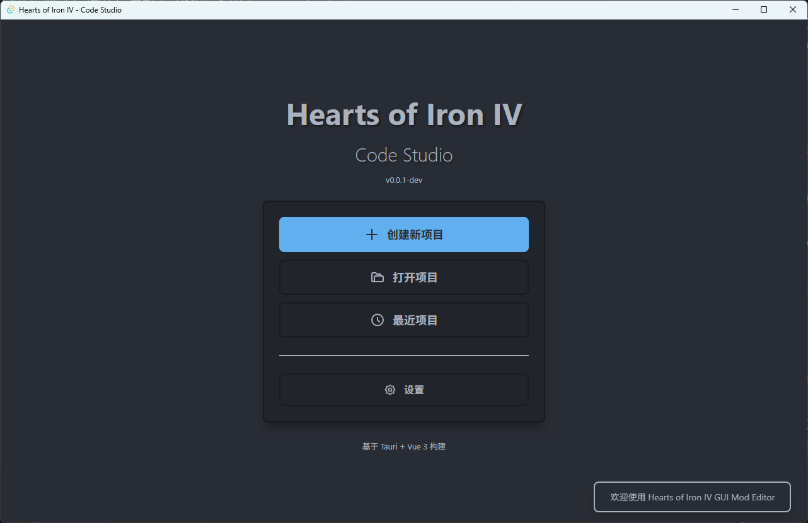
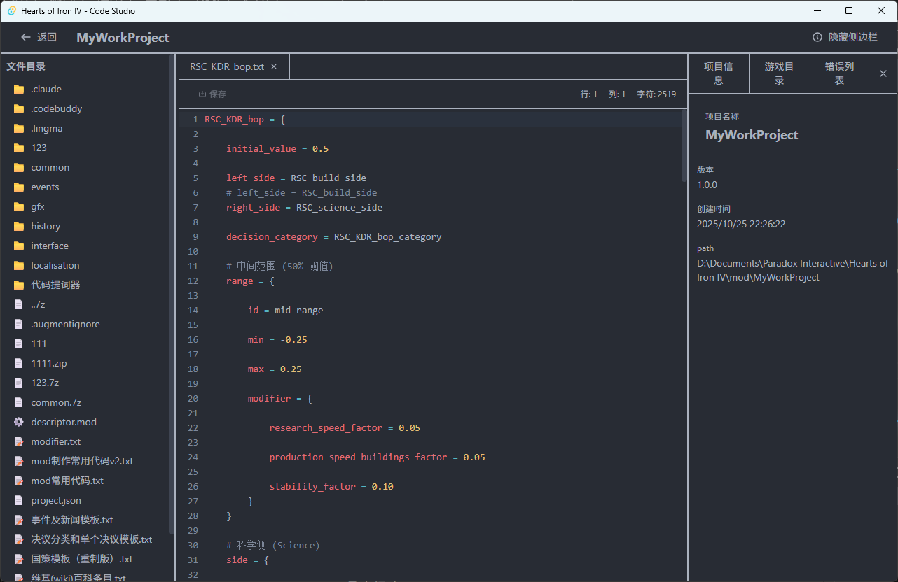

# Hearts of Iron IV - Code Studio

一个基于 **Tauri + Vue 3 + Rust** 的类Vscode的Hearts of Iron IV Mod 编辑器桌面应用程序。

## 主页


## 🚀 快速开始

### 前置要求

- Node.js 18+
- Rust 1.90
- npm

### 安装依赖

```bash
npm install
```

### 开发模式（运行桌面应用）

```bash
npm run tauri dev
```
### 构建桌面应用

```bash
npm run tauri build
```

构建完成后，可执行文件位于：
- `src-tauri/target/release/HOI4 Code Studio.exe`


## 🛠️ 技术栈

### 前端
- **Vue 3** - 渐进式 JavaScript 框架
- **TypeScript** - 类型安全
- **Vue Router** - 路由管理
- **Tailwind CSS** - 实用优先的 CSS 框架
- **Vite** - 快速构建工具

### 后端
- **Rust** - 高性能系统编程语言
- **Tauri** - 构建桌面应用的框架
- **rayon** - 多线程并行处理（用于文件搜索）
- **regex** - 正则表达式支持
- **serde/serde_json** - JSON 序列化
- **chrono** - 日期时间处理
- **rfd** - 文件对话框

## 📝 核心功能

### 项目管理
- ✅ 创建/打开 HOI4 Mod 项目
- ✅ 最近项目列表
- ✅ 项目配置管理
- ✅ 文件树节点选中功能
- ✅ 智能创建文件/文件夹

### 代码编辑器
- ✅ 语法高亮（JSON、YAML、MOD、TXT）
- ✅ 自动缩进和括号匹配
- ✅ 撤销/重做功能
- ✅ 水平/垂直滚动支持
- ✅ 底部固定回弹
- ✅ 分级括号高亮
- ✅ 多文件标签管理
- ✅ 行号显示
- ✅ 部分错误提示
- TODO... 代码提示/错误提示

## 编辑器展示



### 游戏目录集成
- ✅ 游戏目录树展示
- ✅ 文件路径快速复制
- ✅ 与项目文件分离管理

### 编辑器设置
- ✅ 游戏目录配置
- ✅ 最近项目显示设置
- ✅ 自动获取更新设置
- ✅ 配置文件保存位置设置

## 📄 许可证

MIT License

## 🤝 贡献

欢迎提交 Issue 和 Pull Request！

## 推荐 IDE 设置

- [VS Code](https://code.visualstudio.com/)
- [Vue - Official](https://marketplace.visualstudio.com/items?itemName=Vue.volar)
- [Tauri](https://marketplace.visualstudio.com/items?itemName=tauri-apps.tauri-vscode)
- [rust-analyzer](https://marketplace.visualstudio.com/items?itemName=rust-lang.rust-analyzer)
